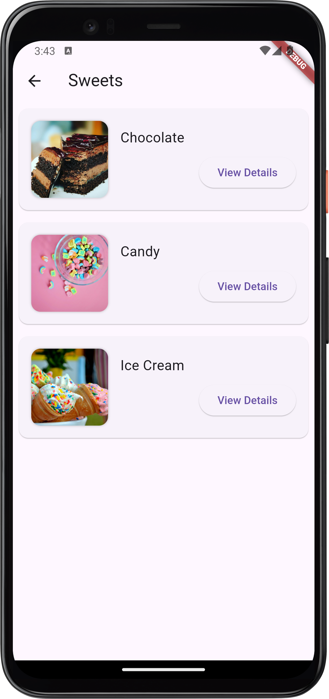

# Flutter project.

> This Flutter project is a user-friendly and interactive menu application featuring three main pages:

## Categories Page (Main Page):
### The landing page showcases various food categories like Fruits, Vegetables, Meat, Fish, Dairy, Bakery, Sweets, and Drinks. Each category is represented with an image and a name, making it easy for users to navigate.

## Products Page:
### When a user selects a category, they are redirected to the Products Page. This page displays a list of products specific to the chosen category, each with an image and name for quick identification.

## Product Details Page:
## By clicking on a specific product, users are taken to the Product Details Page. Here, they can view more detailed information about the product, such as its description, nutritional facts, and price.
